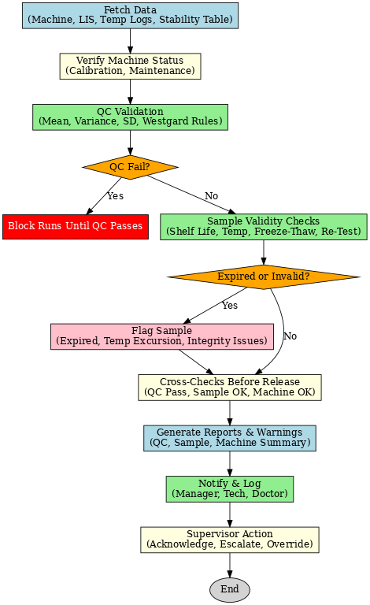
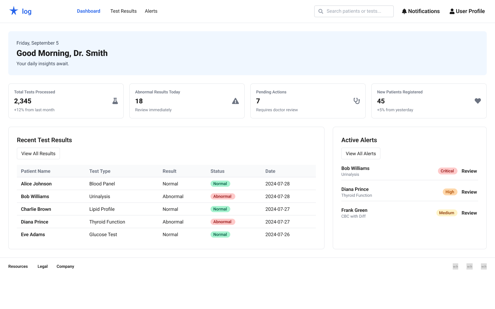
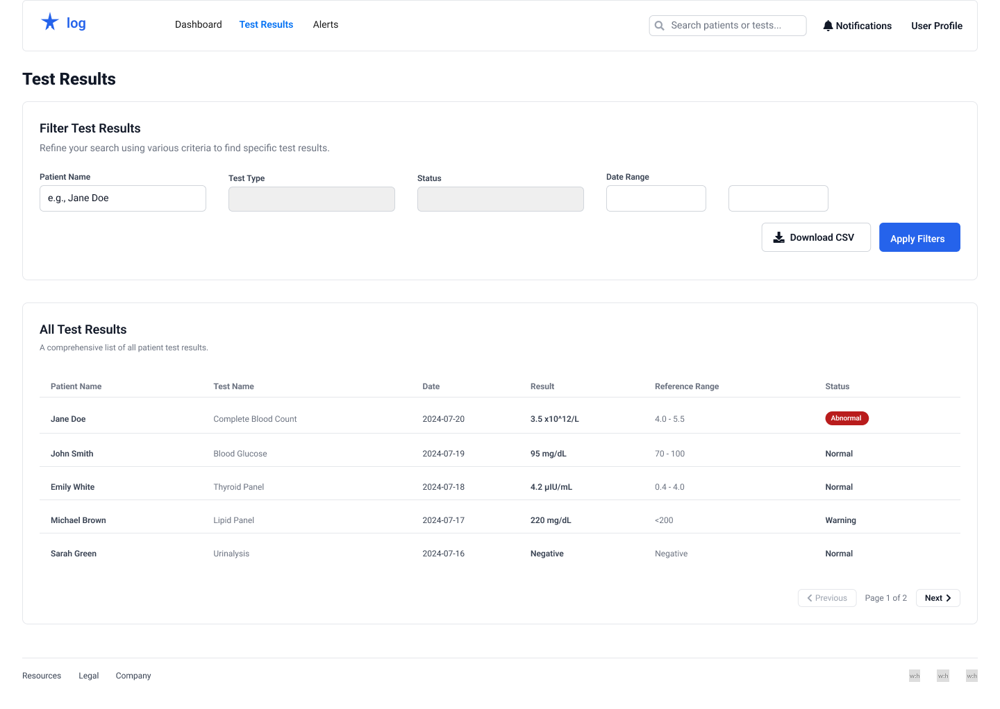
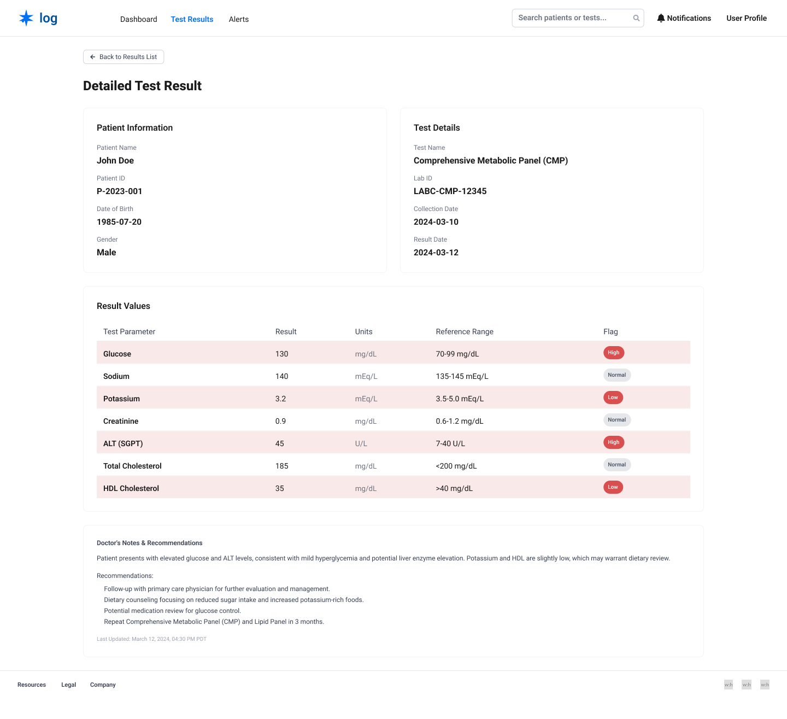
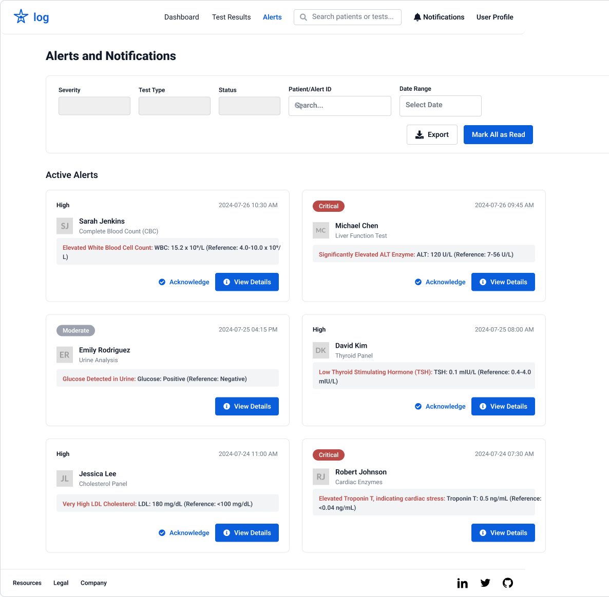

## AHC QC Project Documentation


### How to run this project on your mahine 

#### you can simply use docker with this command
```sh
docker-compose up --build
```

1. ensure you install the packages using 
```sh
npm install
```
2. inside `apps/` folder you can find two folders <br/> the `frontend/` and the `backend` 

3. for running the frontend client use this command

```sh
npm run dev
````
#### it will start the frontend client on `localhost:3001`

4. for running the backend server use this command 

```sh
npm run start:dev
````
#### it will start the backcend server on `localhost:3000`


### The Flow chart 




### Application UI










